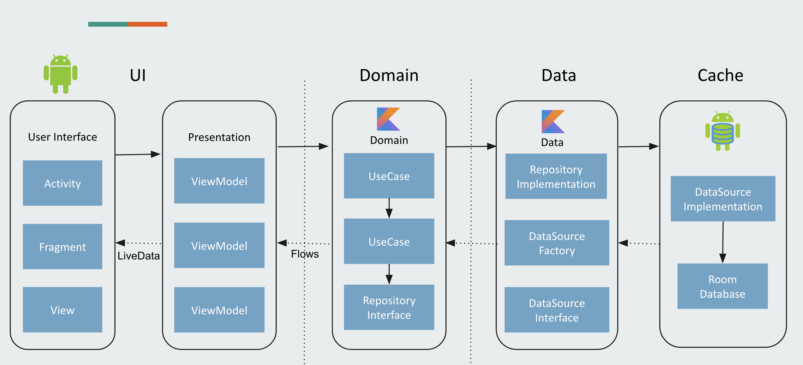

# Easy Note
Easy Note: Notes app using JetPack Compose and MVVM with a clean architecture approach.

This app shows the usage of the new Navigation Architecture Component in collaboration with the Jetpack Compose.

**App features:**
- List of Notes
- Add Edit Notes
- Delete Notes
- Light/ Dark theme.
- Custom font.

## Screenshots

## Architecture
Uses concepts of the notorious Uncle Bob's architecture called [Clean Architecture](https://blog.cleancoder.com/uncle-bob/2012/08/13/the-clean-architecture.html). 

* Better separation of concerns. Each module has a clear API., Feature related classes life in different modules and can't be referenced without explicit module dependency.
* Features can be developed in parallel eg. by different teams
* Each feature can be developed in isolation, independently from other features
* faster compile time

## Modules:
* **app** - It uses all the components and classes releated to Android Framework. It gets the data from presentation layer and shows on UI. (**access all the modules**)
* **core** - Module contains all the resuable compose component and other util classes.
* **feature_note** - Module contains all the classes and interface used to add edit and delete note screen.
* **feature_settings** - Modules contains all the classes and interface used for settings screen

## MAD Scorecard

## Tech stack - Library:

- [Kotlin](https://kotlinlang.org/)
- [Coroutines](https://github.com/Kotlin/kotlinx.coroutines) - A coroutine is a concurrency design pattern that you can use on Android to simplify code that executes asynchronously
- [Flow](https://kotlin.github.io/kotlinx.coroutines/kotlinx-coroutines-core/kotlinx.coroutines.flow/) - Flow is used to pass (send) a stream of data that can be computed asynchronously
- [Dagger-Hilt](https://developer.android.com/training/dependency-injection/hilt-android) - for dependency injection.
- [Kotlin-DSL](https://docs.gradle.org/current/userguide/kotlin_dsl.html) - Used to handle gradle dependencies and config versions
- Compose
    * [Compose Material Components](https://mvnrepository.com/artifact/androidx.compose.material/material)
    * [Compose UI Primitives](https://developer.android.com/jetpack/androidx/releases/compose-ui)
    * [Compose tooling](https://developer.android.com/jetpack/compose/tooling)
    * [Material Icons Extended by Infragistics](https://github.com/IgniteUI/material-icons-extended)
    * [Compose Layouts](https://mvnrepository.com/artifact/androidx.compose.foundation/foundation-layout)
    * [ConstraintLayout Compose](https://developer.android.com/jetpack/androidx/releases/constraintlayout)
    * [Paging Compose](https://developer.android.com/jetpack/androidx/releases/paging)
- JetPack
  * [LiveData](https://developer.android.com/topic/libraries/architecture/livedata) - For reactive style programming (from VM to UI). 
  * [Lifecycle](https://developer.android.com/jetpack/androidx/releases/lifecycle) - Used get lifecyle event of an activity or fragment and performs some action in response to change
  * [ViewModel](https://developer.android.com/topic/libraries/architecture/viewmodel) - Stores UI-related data that isn't destroyed on UI changes. 
  * [Room](https://developer.android.com/topic/libraries/architecture/room) - Used to create room db and store the data.
  * [Navigation](https://developer.android.com/guide/navigation/navigation-getting-started) - Used to navigate between fragments
- [Material-Components](https://github.com/material-components/material-components-android) - Material design components like ripple animation, cardView.

## TODO
- [ ] CI/CD (Github Actions, Bitrise, CircleCI)
- [ ] Unit test
- [ ] Jacoco for test coverage
- [ ] Ktlint or Detekt

## Reference repository
- This repository code is mostly inspired by [Android-Clean-Architecture-Boilerplate](https://github.com/bufferapp/android-clean-architecture-boilerplate).
- Thanks, Philipp Lackner for the excellent tutorial video [Youtube](https://www.youtube.com/watch?v=8YPXv7xKh2w&ab_channel=PhilippLackner) 

## Find this repository useful? :heart:
Support it by joining __[stargazers](https://github.com/akhilesh0707/Easy-Note/stargazers)__ for this repository. :star:  
And __[follow](https://github.com/akhilesh0707)__ me for my next creations! 🤩

## Contributions
Please feel free to file an issue for errors, suggestions or feature requests. Pull requests are also encouraged.
