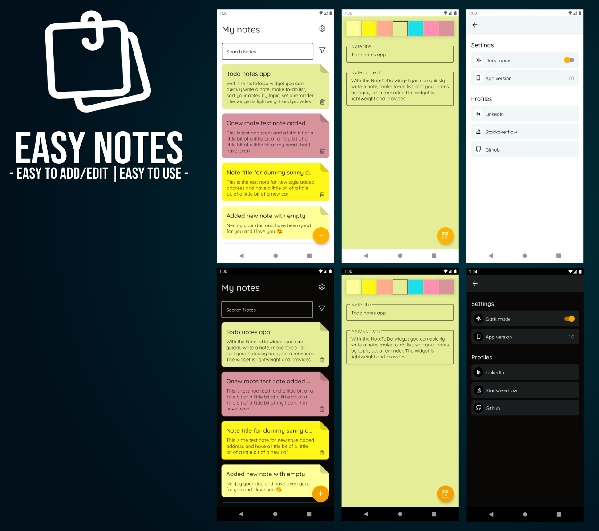

# Easy Note
Easy Note: Notes app using JetPack Compose and MVVM with a clean architecture approach.

This app shows the usage of the new Navigation Architecture Component in collaboration with the Jetpack Compose.

**App features:**
- List of Notes
- Add Edit Notes
- Delete Notes
- Light/ Dark theme.
- Custom font.

## Screenshots

